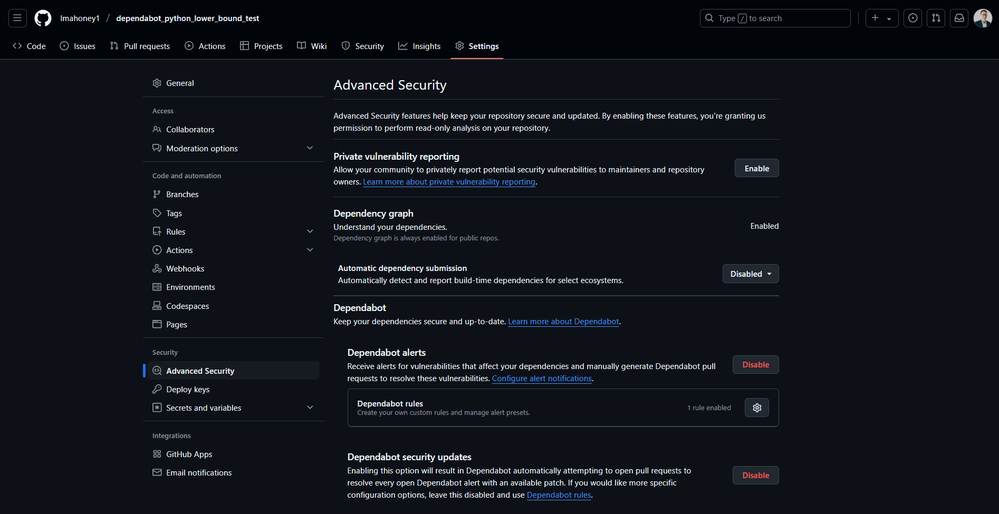
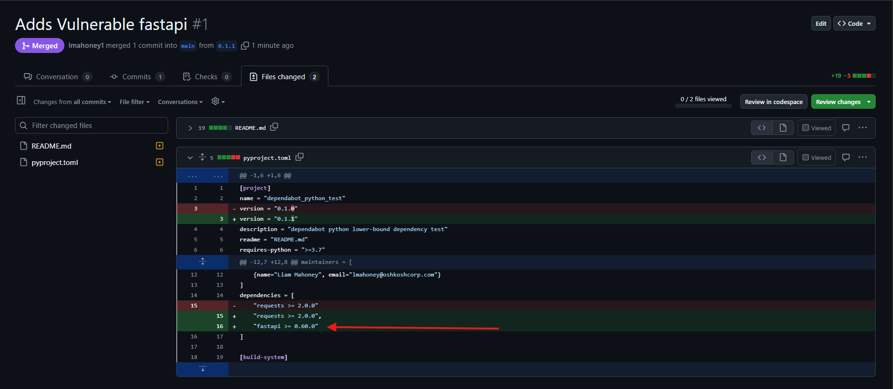
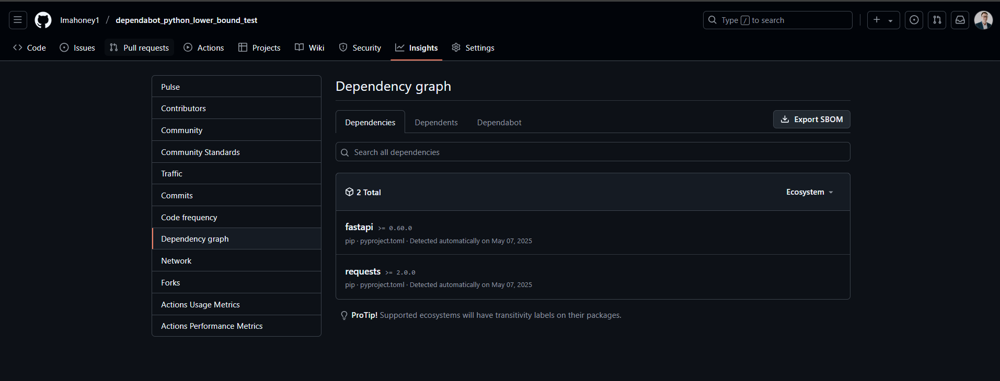
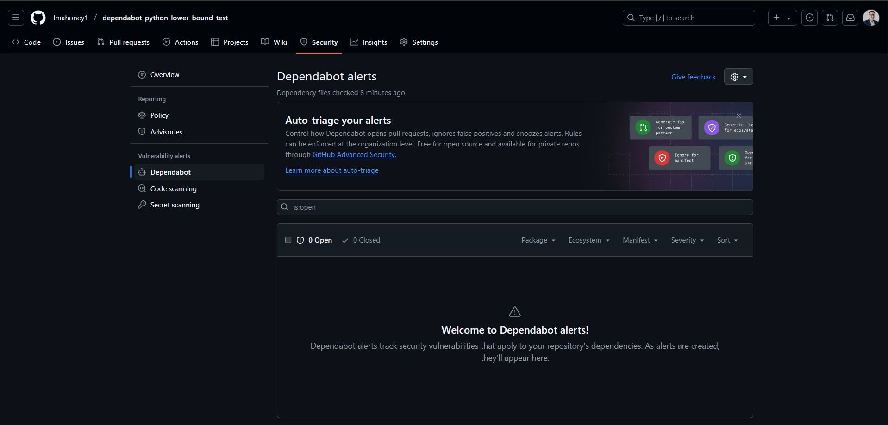

# dependabot_python_test

Example of dependabot not alerting on vulnerable dependencies specified with only a lower-bound.

```toml
dependencies = [
    "requests >= 2.0.0"
]
```

Was hoping dependabot would bump the lower-bound version to the lowest version without a vulnerability.

Vulnerable dependencies and GitHub advisory entries (not exhaustive - I didn't figure out how to search on package name):
- requests
    - https://github.com/advisories/GHSA-9wx4-h78v-vm56
    - https://github.com/advisories/GHSA-cfj3-7x9c-4p3h
    - https://github.com/advisories/GHSA-652x-xj99-gmcc
    - https://github.com/advisories/GHSA-x84v-xcm2-53pg
- fastapi
    - https://github.com/advisories/GHSA-8h2j-cgx8-6xv7

## Testing

Enabled 'Dependabot alerts' and 'Dependabot security updates' in repository settings:



Created pull request [#1](https://github.com/lmahoney1/dependabot_python_lower_bound_test/pull/1) which added `"fastapi >= 0.60.0"` as a dependency.



Merged the pull request into default branch. Verified dependency graph was updated to include `fastapi`



Not seeing any security alerts generated:



### Expectation

Was hoping dependabot would raise a secuirty alert and attempt to raise the lower bound to the lowest version of the package that does not have a vulnerability.

In this case I would like to see dependabot change the entry in `pyproject.toml` to be `fastapi >= 0.65.2`

```diff
[project]
name = "dependabot_python_test"
version = "0.1.1"
description = "dependabot python lower-bound dependency test"
readme = "README.md"
requires-python = ">=3.7"
license = {file = "LICENSE.txt"}
authors = [
    {name="Liam Mahoney", email="lmahoney@oshkoshcorp.com" } 
]
maintainers = [
    {name="Liam Mahoney", email="lmahoney@oshkoshcorp.com"}
]
dependencies = [
    "requests >= 2.0.0",
-    "fastapi >= 0.60.0"
+    "fastapi >= 0.65.2"
]

[build-system]
requires = ["setuptools", "setuptools-scm"]
build-backend = "setuptools.build_meta"
```

Possible dependabot isn't designed to work for python dependencies only specified with a lower-bound like this?